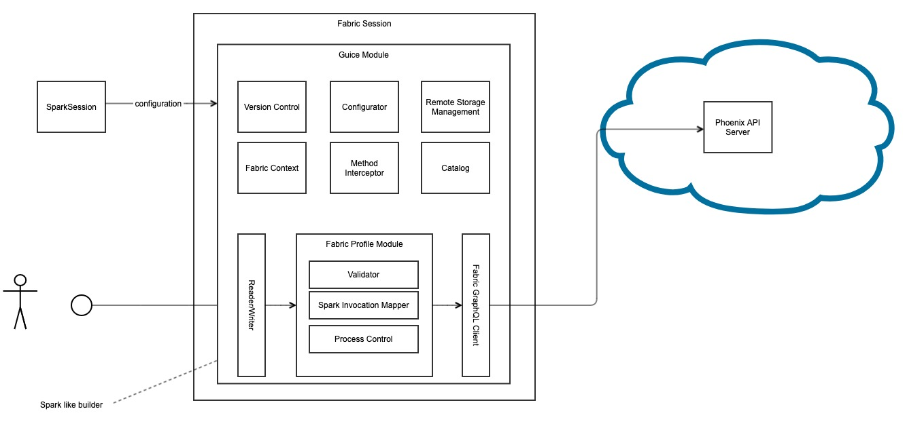

# Cortex Profiles SDK

The Cortex Profiles SDK is collection of Java/Kotlin libraries, examples, and templates for utilizing Cortex Fabric in a Spark
based environment, whether that be on your local machine or in a Cortex Fabric Cluster.

These examples are structured in step-by-step way to display the array of possible usages of currently available features in the Cortex Profiles SDK.


1. [Overview](#overview)
2. [Installation and Setup](#installation-and-setup)
    1. [Recommended JVM Settings](#recommended-jvm-settings)
    2. [JFrog Artifactory Setup](#jfrog-artifactory-setup)
    3. [Developer Setup](#developer-setup)
3. [Examples](#examples)
4. [FAQ](#faq)
5. [Version Compatibility](#version-compatibility)
6. [Resources](#resources)

## Overview

<!-- TODO: Need to create an alternative image to better display the image. Want to replace  Fabric -> Cortex and outer "Fabric Session" w/ "Cortex Profiles SDK" -->


The core of the Profiles SDK is a library that exposes an interface to Cortex for utilizing Spark for custom processing
of Profile relate data. The entrypoint to the Profiles SDK is the `CortexSession`, a session based API around Spark and the `SparkSession`.
The Profiles SDK (`CortexSession`) provides
- an extensible dependency injected platform that allows for process, module, and environment (local vs in Cortex cluster) specific configuration
- access to [Cortex Catalog](./docs/catalog.md)
- access to Cortex Backend Storage (e.g. Managed Content and Profiles)
- configurable provider for Cortex [Secrets](./docs/secrets.md)
- stream and batch processing support for Cortex Data Sources and Connections <!-- and Profiles? -->
- access to Cortex Phoenix job flows for ingesting DataSources and building Profiles
- Spark property based configuration options, see [config.md](./docs/config.md)
- a [Cortex Skill Template](./templates) with a [Spark-Submit](TODO) based launcher
<!-- - a [Version Compatibility](#version-compatibility) check with platform dependencies -->

## Installation and Setup

The Cortex Profiles SDK consists of:
* The Profiles SDK Jar (`com.c12e.cortex.profiles:profiles-sdk:6.3.0-M.2`)
* Platform Dependencies Jar (`com.c12e.cortex.profiles:platform-dependencies:6.3.0-M.2`)
* Example Materials and Templates located in this repo

The Profile SDK Jar's can be pulled from CognitiveScale's JFrog Artifactory, if access has been shared with
you. Follow the [JFrog Artifactory Developer Setup](./docs/dev.md#jfrog-artifactory-setup).

### Recommended JVM Settings

These can also be set/controlled through the `~/.gradle/gradle.properties` file that needs to be setup.
```
export GRADLE_OPTS="-Dorg.gradle.jvmargs='-Xmx2g -XX:MaxMetaspaceSize=512m -XX:+UseG1GC -XX:+UseStringDeduplication -XX:+OptimizeStringConcat'"
```

### JFrog Artifactory Setup

1. Java 11 (use Openjdk, see the link in [Resources](#resources) section)
1. JFrog Artifactory credentials (shared in LastPass with everyone in `Shared-Engineering` folder)
1. Install IntelliJ IDEA with the latest Kotlin plugin enabled ([Intellij IDEA](https://www.jetbrains.com/idea/))
1. Put JFrog Artifactory credentials in `$USER_HOME/.gradle/gradle.properties` file. See `gradle.properties.template` for instructions.

### Developer Setup

See [dev.md](./docs/dev.md) how to work with a local (developer) installation of the Cortex Profiles SDK.

## Examples

Examples are structured to build upon themselves and grow in complexity. Each provides their own instructions for
running as well as additional context. The top level [main-app](./main-app/README.md) is a CLI wrapper around the other
examples:

* [Local Cortex Clients](./local-clients/README.md)
* [Join Connections](./join-connections/README.md)
* [DataSource Refresh](./datasource-refresh/README.md)
* [Build Profiles](./build-profiles/README.md)

[picocli](https://picocli.info/) is used by each example to create a minimal CLI application for running the example.
Refer to the instructions in each example.

<!-- TODO(LA):
* Fix missing classpath for CustomSecretsClient when running in a docker container (need to include all values in a jar)
* Add instructions to join-connections example for running locally against dci-dev.
* Port DataSource/Connection streaming examples to their own module
-->

## Skill Template

The [Skill Template](./templates) directory contains files for packaging as [Cortex Job Skill](./templates/skill.yaml), where:
* The input to the skill is a JSON Payload with the path to [Spark Configuration File](https://spark.apache.org/docs/latest/submitting-applications.html) mounted in the container. See [payload.json](./templates/payload.json).
* The output of the skill is the output of the Job
* The [docker image](./main-app/src/main/resources/Dockerfile) for the `main-app` uses
  a [Spark Submit](https://spark.apache.org/docs/latest/submitting-applications.html) based wrapper to trigger the Spark
  application. The resources for the spark-submit wrapper is in the [main-app/src/main/resources/python/](./main-app/src/main/resources/python)
  and is necessary for packaging as a Skill.

**Before creating the skill**, you will need to:
* verify `main-app/src/main/resources/conf/spark-conf.json` configuration file is running the intended example. For example, the below config file specifies the command to run the `join-connections` example,
* verify the `payload.json` file points the correct Spark configuration file ([spark-conf.json](./main-app/src/main/resources/conf/spark-conf.json))

```json
{
    "pyspark": {
        "pyspark_bin": "bin/spark-submit",
        "app_command": [
            "join-connections",
            "-p",
            "local",
            "-l",
            "member-base",
            "-r",
            "member-flu-risk",
            "-w",
            "member-joined"
        ],
        "app_location": "local:///app/libs/app.jar",
        "options": {
            "--master": "local[*]",
            "--class": "com.c12e.cortex.examples.Application",
            "--conf": {
                "spark.cortex.client.phoenix.url": "https://api.dci-dev.dev-eks.insights.ai/fabric/v4/graphql",
                "spark.cortex.catalog.impl": "com.c12e.cortex.profiles.catalog.CortexRemoteCatalog",
            }
        }
    }
}

```

To build the skill, you will need to set the environment variables the follow the corresponding make commands:
* `DOCKER_PREGISTRY_URL=xxxx` <-- Private Registry Url accessible from Cortex
* `PROJECT_NAME=xxxx` <-- name of the project to save the skill, action and types
* `CORTEX_TOKEN=xxxx` <-- for connecting to api-server

Make Commands:
```
# Building and pushing the skill container, saving the skill and the types
make deploy-skill

# Tag the latest create-app-image built container
make tag-container

# Push the container
make push-container

# Deploy the action and save the skill
make skill-save

# Save types
make types-save

# Invoke the skill with payload
make invoke
```

## FAQ
* How are users installing this? 
  - See [Installation and Setup](#installation-and-setup)
* Is this installed or configured in [Cortex Charts](https://github.com/CognitiveScale/cortex-charts)?
  - Nope, the SDK is entirely separate from Cortex Charts (though some configuration options may be similar).
* Is this a sort of Standalone tool? (like the Cortex CLI)
  - Yes and no! The core of the Cortex Profiles SDK is a standalone library, that has platform (pluggable) Spark and hadoop dependencies. The SDK is its own standalone tool, but it will not stand on its own.
* Spark has a number of levers identified in their docs, which ones are most critical for the Profiles SDK?
  - For configuration option reference, see [here](docs/config.md). (This is missing guidance on tuning, but we can add as we iterate).
* Is the code annotated to point out the customization areas/options? 
  - The generated API documentation includes Spark (Cortex) Configuration options and will describe related
    configuration properties and abilities. The initial documentation is minimal in certain areas, but bill we itreated on.
    For a full list of configuration options see [config.md](docs/config.md)
* Does this use the [Cortex CLI](https://www.npmjs.com/package/cortex-cli) or ~~Phoenix CLI (AMP CLI)~~?
    - No, neither are used by nor required by the Profiles SDK. The Cortex CLI is a separate tool that would facilitate
      developing with the Profiles SDK for generating Tokens and creating Cortex Resources. The Phoenix CLI is not
      public facing, and the Profiles SDK will eventually overcome/replace the Phoenix CLI as it supports the same
      functionality with more flexible configuration.

## Version Compatibility

<!-- TODO: Crossed out because this check shouldn't happen automatically? -->
~~The Profiles Library contains version compatibility check to verify compatible Spark and Hadoop are provided in the environment.~~

| Profiles SDK Version | Cortex Version | Spark Version | Hadoop Version | Delta Version |
|----------------------|----------------|---------------|----------------|---------------|
| 6.3.0                | 6.3.0          | 3.2.1         | 3.3.1          | 1.1.0         |

Additionally, refer to the [Cortex Compatibility Matrix](https://cognitivescale.github.io/cortex-fabric/docs/getting-started/compatibility-matrix)

## Resources
* [Java 11 Installer](https://adoptopenjdk.net/archive.html?variant=openjdk11&jvmVariant=hotspot)
* [Spark Configurations](https://spark.apache.org/docs/latest/index.html)
* [Cortex Fabric](https://cognitivescale.github.io/cortex-fabric/)
* [Cortex Fabric Glossary](https://cognitivescale.github.io/cortex-fabric/docs/reference-guides/glossary)
* [Cortex Fabric GraphQL API Reference](https://cognitivescale.github.io/cortex-fabric/graphql-6.2.2/index.html)
* [Cortex Profiles SDK API Documentation](TODO)
* [Cortex Compatibility Matrix](https://cognitivescale.github.io/cortex-fabric/docs/getting-started/compatibility-matrix)
* [Cortex CLI](https://www.npmjs.com/package/cortex-cli)

