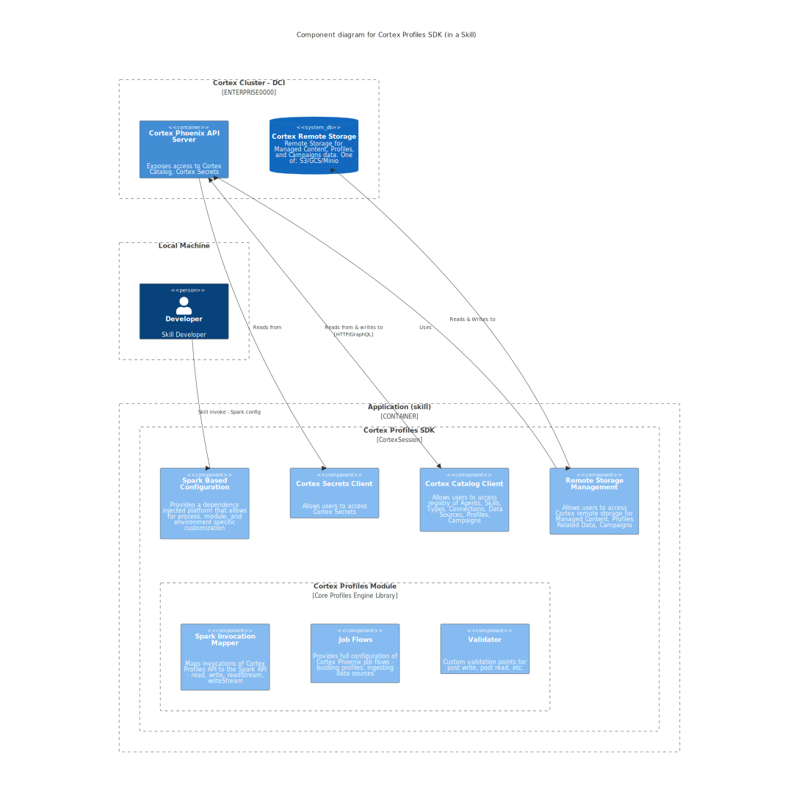
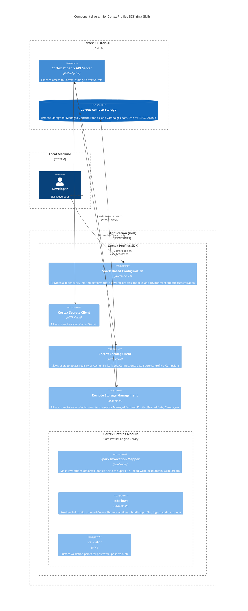

# Cortex Profiles SDK

The Cortex Profiles SDK is collection of Java/Kotlin libraries, examples, and templates for utilizing Cortex Fabric in a Spark
based environment, either on your local instance or in a Cortex Fabric Cluster.

These examples are structured in step-by-step way to display the array of usages of the currently available features in the Cortex Profiles SDK.

1. [Overview](#overview)
2. [Installation and Setup](#installation-and-setup)
   1. [Recommended JVM Settings](#recommended-jvm-settings)
   2. [JFrog Artifactory Setup](#jfrog-artifactory-setup)
   3. [Developer Setup](#developer-setup)
3. [Examples](#examples)
4. [Skill Template](#skill-template)
2. [Resources](#resources)


## Overview



<!-- Component diagram is still experimental and not viewable on Github, hence using an SVG.

-->

The core of the Profiles SDK is a library that exposes an interface to Cortex for utilizing Spark for custom processing
of Profile related data. The entrypoint to the Profiles SDK is the `CortexSession`, a session based API around Spark and the `SparkSession`.
The Profiles SDK provides:
- An extensible dependency injected platform that allows for process, module, and environment (local vs in Cortex cluster) specific configuration <!-- TODO: link to Guice -->
- Access to [Cortex Catalog](./docs/catalog.md)
- Access to [Cortex Backend Storage](./docs/backendstorage.md) (e.g. Managed Content and Profiles)
- Configurable provider for Cortex [Secrets](./docs/secrets.md)
- Stream and batch processing support for Cortex Connections
- Access to Cortex Phoenix job flows for ingesting Data Sources and building Profiles
- Spark property-based [configuration options](./docs/config.md)
- A [Cortex Skill Template](./templates) with a [spark-submit](https://spark.apache.org/docs/latest/submitting-applications.html) based launcher
<!-- - a [Version Compatibility](#version-compatibility) check with platform dependencies -->

## Installation and Setup

The Cortex Profiles SDK consists of:
* The Profiles SDK jar file (`com.c12e.cortex.profiles:profiles-sdk`)
* Platform dependencies jar file (`com.c12e.cortex.profiles:platform-dependencies`)
* Example materials and templates located in this repo

The Profile SDK jar files can be pulled from CognitiveScale's JFrog Artifactory if access has been shared with
you. Follow the [JFrog Artifactory Developer Setup](./docs/dev.md#jfrog-artifactory-setup).

### Recommended JVM Settings

JVM Settings can be set via the `GRADLE_OPTS` environment variable:
```
export GRADLE_OPTS="-Dorg.gradle.jvmargs='-Xmx2g -XX:MaxMetaspaceSize=512m -XX:+UseG1GC -XX:+UseStringDeduplication -XX:+OptimizeStringConcat'"
```

Alternatively, you can update the `$USER_HOME/.gradle/gradle.properties` file by adding the following lines. Create the
file if it does not already exist.
```
org.gradle.jvmargs=-Xmx2g -XX:MaxMetaspaceSize=512m -XX:+UseG1GC -XX:+UseStringDeduplication -XX:+OptimizeStringConcat
```

### JFrog Artifactory Setup

1. Install Java 11 using the [Resources](#resources) section.
1. Obtain JFrog Artifactory credentials (shared in LastPass with everyone in `Shared-Engineering` folder).
1. Install IntelliJ IDEA with the latest Kotlin plugin enabled ([Intellij IDEA](https://www.jetbrains.com/idea/)).
1. Put JFrog Artifactory credentials in `$USER_HOME/.gradle/gradle.properties` file. (See `gradle.properties.template` for instructions.)

### Developer Setup

To work with a local (developer) installation of the Cortex Profiles SDK see [dev.md](docs/dev.md#local-developer-setup).

## Examples

Examples are structured to build upon themselves and grow in complexity. Each provides its own instructions for
running as well as additional context. The top level [main-app](./main-app/README.md) is a CLI wrapper around the other
examples:

* [Using Local Cortex Clients](./local-clients/README.md)
* [Join Two Connections](./join-connections/README.md)
* [Refresh a DataSource](./datasource-refresh/README.md)
* [Build Profiles](./build-profiles/README.md)
* [Streaming to a Data Source](./datasource-streaming/README.md)
* [Using a CData Connection](./cdata-connection/README.md)
* [Reading From BigQuery](./bigquery-connection/README.md)

[picocli](https://picocli.info/) is used by each example to create a minimal CLI application for running the example.
Refer to the instructions in each example.

### Add a Java Module Example

The examples are structured as a [Gradle multi-project build](https://docs.gradle.org/current/userguide/multi_project_builds.html).

To include a new project in the example Profiles application you will need to:
* Create a new Java module. Ensure the new project is included in the `settings.gradle.kts` file.
* Include the `com.c12e.cortex.profiles:profiles-sdk` and `com.c12e.cortex.profiles:platform-dependencies`
  as [api dependencies](https://docs.gradle.org/current/userguide/dependency_management_for_java_projects.html#sec:configurations_java_tutorial)
  in your configuration. You can refer to the [join-connections/build.gradle.kts](join-connections/build.gradle.kts) for
  an example setup including the Profiles SDK, [picocli](https://picocli.info/), and Junit dependencies.
* (Optional) Include a main CLI entrypoint in your module using [picocli](https://picocli.info/).
* Include your project in the main application.
  - Add your project as a dependency of the `main-app`. In `main-app/build.gradle.kts` add `implementation(project(":<your-project>"))` to `dependencies`.
  - Add your project source to `main-app` jar file. In `main-app/build.gradle.kts` add `from(project(":<your-project>"))` to the `Jar` task (`tasks.withType<Jar>`).
  - (Optional) If you included a CLI entrypoint in your module, then you can list it as a subcommand by importing the
    class in [Application.java](main-app/src/main/java/com/c12e/cortex/examples/Application.java). Refer to the existing
    subcommands in [Application.java](main-app/src/main/java/com/c12e/cortex/examples/Application.java) for an example
    on how to include the class as a subcommand.

## Skill Template

The [Skill Template](./templates) directory contains files for packaging as [Cortex Job Skill](templates/skill.yaml), where:
* The input to the skill is a [JSON Payload](templates/payload.json) with the path to [Spark Configuration File](https://spark.apache.org/docs/latest/submitting-applications.html).
* The output of the skill is the Job execution logs.
* The [Docker image](main-app/src/main/resources/Dockerfile) for the `main-app` uses a [spark-submit](https://spark.apache.org/docs/latest/submitting-applications.html)
  based wrapper to launch the Spark application. The resources for the `spark-submit` wrapper is in the
  [main-app/src/main/resources/python/](./main-app/src/main/resources/python) directory and is necessary for packaging
  the Skill.

**NOTE:** The `ENTRYPOINT` for the Docker image is [scuttle](https://github.com/CognitiveScale/scuttle). When running application
in a Docker container locally, you should set the `--entrypoint` option.

1. **Before creating the Skill**, you will need to:
* Set the Private Registry URL accessible from Cortex as an environment variable, `export DOCKER_PREGISTRY_URL=...`.
* Set the Name of the Project to save the Skill, Action, and Types, `export PROJECT_NAME=xxxx`.
* Set the Cortex Token authenticating to Cortex, `export CORTEX_TOKEN=xxxx`.
* Update the [spark-conf.json](main-app/src/main/resources/conf/spark-conf.json) with the CLI application command and other config options.
* Verify the Skill's `payload.json` file refers to the above Spark configuration file (in the built container).


2. **Build the Skill**.
    ```
    make all
    ```

    The final output should look similar to:
    ```
    docker build --build-arg base_img=c12e/spark-template:profile-jar-base-6.3.0-M.2.1 -t profiles-example:latest -f ./main-app/build/resources/main/Dockerfile ./main-app/build
    [+] Building 1.5s (17/17) FINISHED
    => [internal] load build definition from Dockerfile                                                                                                                                                                                     0.0s
    => => transferring dockerfile: 37B                                                                                                                                                                                                      0.0s
    => [internal] load .dockerignore                                                                                                                                                                                                        0.0s
    => => transferring context: 2B                                                                                                                                                                                                          0.0s
    => [internal] load metadata for docker.io/c12e/spark-template:profile-jar-base-6.3.0-M.2.1                                                                                                                                              1.0s
    => [auth] c12e/spark-template:pull token for registry-1.docker.io                                                                                                                                                                       0.0s
    => FROM docker.io/redboxoss/scuttle:latest                                                                                                                                                                                              0.4s
    => => resolve docker.io/redboxoss/scuttle:latest                                                                                                                                                                                        0.4s
    => [internal] load build context                                                                                                                                                                                                        0.0s
    => => transferring context: 1.16kB                                                                                                                                                                                                      0.0s
    => [stage-0 1/9] FROM docker.io/c12e/spark-template:profile-jar-base-6.3.0-M.2.1@sha256:331f93e1290442934adbd14e904740ef458d2ea012c3288d689608e9202899dd                                                                                0.0s
    => [auth] redboxoss/scuttle:pull token for registry-1.docker.io                                                                                                                                                                         0.0s
    => CACHED [stage-0 2/9] COPY --from=redboxoss/scuttle:latest /scuttle /bin/scuttle                                                                                                                                                      0.0s
    => CACHED [stage-0 3/9] COPY ./resources/main/python/ .                                                                                                                                                                                 0.0s
    => CACHED [stage-0 4/9] RUN pip3 install -r requirements.txt                                                                                                                                                                            0.0s
    => CACHED [stage-0 5/9] COPY ./libs/main-app-1.0.0-SNAPSHOT.jar /app/libs/app.jar                                                                                                                                                       0.0s
    => CACHED [stage-0 6/9] COPY ./libs/main-app-1.0.0-SNAPSHOT.jar /opt/spark/jars                                                                                                                                                         0.0s
    => CACHED [stage-0 7/9] COPY ./resources/main/spark-conf /opt/spark/conf                                                                                                                                                                0.0s
    => CACHED [stage-0 8/9] COPY ./resources/main/lib/*.jar /opt/spark/jars/                                                                                                                                                                0.0s
    => CACHED [stage-0 9/9] COPY ./resources/main/conf /app/conf                                                                                                                                                                            0.0s
    => exporting to image                                                                                                                                                                                                                   0.0s
    => => exporting layers                                                                                                                                                                                                                  0.0s
    => => writing image sha256:94dd0d11a31abcd3d23d97b003ffceb30e9eafc38c77dba9f3b92d6ea8633526                                                                                                                                             0.0s
    => => naming to docker.io/library/profiles-example:latest                                                                                                                                                                               0.0s
    docker tag profiles-example:latest private-registry.dci-dev.dev-eks.insights.ai/profiles-example:latest
    docker push private-registry.dci-dev.dev-eks.insights.ai/profiles-example:latest
    The push refers to repository [private-registry.dci-dev.dev-eks.insights.ai/profiles-example]
    12898f60c37f: Layer already exists
    ece5a5cb892e: Layer already exists
    4bc783276212: Layer already exists
    e310b2eec001: Layer already exists
    b995497ccd6e: Layer already exists
    4b156e5303b4: Layer already exists
    2012777427ee: Layer already exists
    4fae41f79235: Layer already exists
    ea16b97b6399: Layer already exists
    7628da35a3c9: Layer already exists
    5f70bf18a086: Layer already exists
    7723dc94285f: Layer already exists
    latest: digest: sha256:aa4c3a4dc42a4af55ab0eac6d5bdc3c226828b133013bdea21d297698b43471d size: 2830
    cortex types save -y templates/types.yaml --project testi-69257
    Type definition saved
    cortex actions deploy --actionName profiles-example --actionType job --docker private-registry.dci-dev.dev-eks.insights.ai/profiles-example:latest --project laguirre-testi-69257 --cmd '["scuttle", "python", "submit_job.py"]' --podspec ./templates/podspec.yaml
        {
        "success": true,
        "action": {
            "_isDeleted": false,
            "_projectId": "testi-69257",
            "_createdBy": "laguirre@example.com",
            "name": "profiles-example",
            "description": "",
            "image": "private-registry.dci-dev.dev-eks.insights.ai/profiles-example:latest",
            "type": "job",
            "command": [
                "scuttle",
                "python",
                "submit_job.py"
            ],
            "scaleCount": 1,
            "podSpec": "[{\"path\":\"/containers/0/imagePullPolicy\",\"value\":\"Always\"}]",
            "jobTimeout": 0,
            "k8sResources": [],
            "environmentVariables": null,
            "createdAt": "2022-07-15T22:33:46.250Z",
            "updatedAt": "2022-07-15T22:33:46.250Z",
            "_version": 8
        }
    }
    cortex skills save -y templates/skill.yaml --project testi-69257
    Skill saved: {"success":true,"version":8,"message":"Skill definition profiles-example saved."}
    ```

3. **Invoke the Skill**.
    ```
    make invoke
    ```

    Example Output:
    ```
    cortex skills invoke --params-file templates/payload.json profiles-example params --project laguirre-testi-69257
    {
      "success": true,
      "activationId": "115d1196-408a-47fa-91c4-6f8e8a391641"
    }
    ```
4. Run `cortex agents get-activation <activation-id>` or `cortex tasks logs <task-name>` to view logs of the skill activation.

<!--
# Version Compatibility

| Profiles SDK Version | Cortex Version | Spark Version | Hadoop Version | Delta Version |
|----------------------|----------------|---------------|----------------|---------------|
| 6.3.0                | 6.3.0          | 3.2.1         | 3.3.1          | 1.1.0         |

Additionally, refer to the [Cortex Compatibility Matrix](https://cognitivescale.github.io/cortex-fabric/docs/getting-started/compatibility-matrix)
-->

## Resources
* [Java 11 Installer](https://adoptopenjdk.net/archive.html?variant=openjdk11&jvmVariant=hotspot)
* [Spark Configurations](https://spark.apache.org/docs/latest/index.html)
* [Cortex Fabric](https://cognitivescale.github.io/cortex-fabric/)
* [Cortex Fabric Glossary](https://cognitivescale.github.io/cortex-fabric/docs/reference-guides/glossary)
* [Cortex Fabric GraphQL API Reference](https://cognitivescale.github.io/cortex-fabric/graphql-6.2.2/index.html)
* [Cortex Profiles SDK API Documentation](TODO)
* [Cortex Compatibility Matrix](https://cognitivescale.github.io/cortex-fabric/docs/getting-started/compatibility-matrix)
* [Cortex CLI](https://www.npmjs.com/package/cortex-cli)
