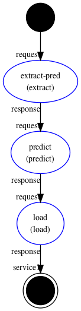
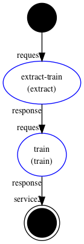

## Agent 

We expose two services in the same agent

  |  

## Deploy skills

1. build
```
cortex workspaces build
```

2. publish 
```
cortex workspaces publish
```

3. save the agent
```
cortex agents save agent.json
```

4. call service1 (predict)
```
cortex agents invoke --params-file skills/extract/invoke/request/message.json example3 service1
```

5. call service2 (train)
```
cortex agents invoke --params-file skills/extract/invoke/request/message.json example3 service2
```