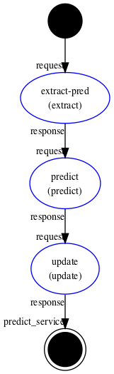
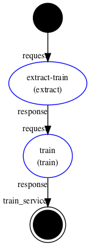
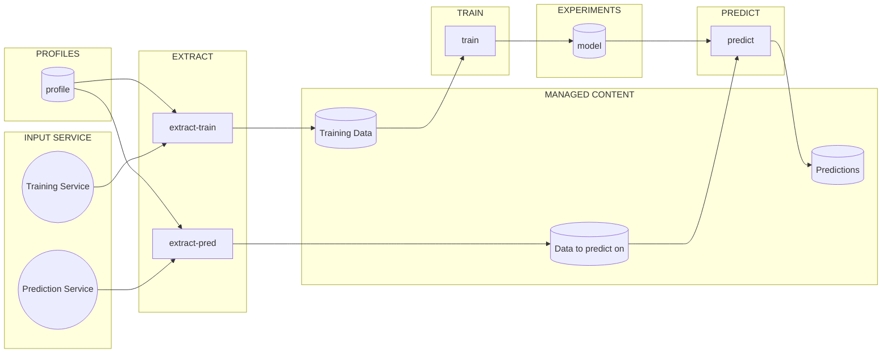
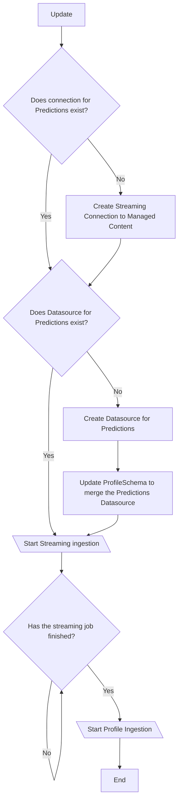

## Agent 

We expose two services in the same agent

    






## Deploy skills

1. build
```
cortex workspaces build
```

2. publish 
```
cortex workspaces publish
```

3. save the agent
```
cortex agents save agent.json
```

4. call training service 
```
cortex agents invoke --params-file skills/extract/invoke/request/message_train.json example3 train_service
```

5. call prediction service
```
cortex agents invoke --params-file skills/extract/invoke/request/message_pred.json example3 predict_service
```